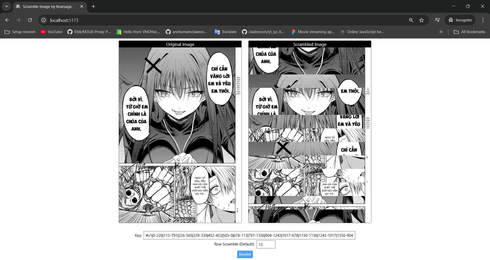

# 🖼️ Image Scrambler

A small application written in **React + Canvas** that helps you upload an image, then split the image into multiple rows and shuffle the rows. 
The result is displayed in parallel between the original image and the scrambled image.

---

## 🚀 Features

- [x] Upload images from your computer (`.jpg`, `.png`, …).

- [x] Automatically split the image into the appropriate number of rows (default `10`, can be changed).

- [x] Randomly shuffle the image rows.

- [x] Generate `Key` (string containing swap information) that can be used for decoding.

- [x] Display the original image and the scrambled image in parallel.
- [x] Download images.
- [ ] Accept upload images.
- [ ] Encrypt `Key` with base64 and XOR. 

## 📷 Demo

  

Live: https://scramble-image.vercel.app/

# Thank's for using<3